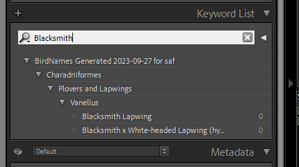
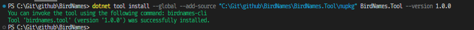
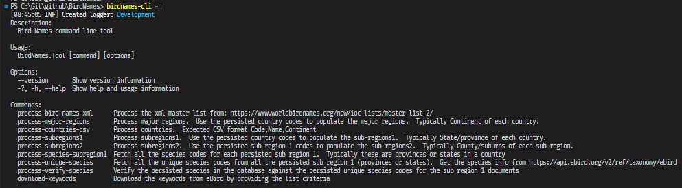

# BirdNames Hierarchical KeywordList Generator
This project was developed to create hierarchical keyword lists for Adobe Lightroom Classic.  See sample below...



## Repository Structure

- `BirdNames.Blazor/`: A Blazor server project the is the UI.
- `BirdNames.Core/`: The bulk of the code and logic.  Shared between the UI and the Tool.
- `BirdNames.Dal/`: The library code responsible for communicating with the MongoDB database.
- `BirdNames.Models/`: The models that are shared and also used as schema for the MongoDB collections.
- `BirdNames.Tool/`: The command line interface (Tool).  This can be installed and used instead of the UI.

## Getting Started
First and foremost, you will need to register on https://ebird.org.  After registration is complete, request access and get an API Key.  This is essential.

### Install MongoDB or run it in a docker container
Get the [MongoDB](https://www.mongodb.com/try/download/community) installation from https://www.mongodb.com/try/download/community.  If you are familiar with Docker.  Get an [image](https://www.mongodb.com/compatibility/docker) from https://www.mongodb.com/compatibility/docker

### Dotnet
This project was developed in C# and uses the Dotnet 7 runtime.  Use Visual Studio or Visual Studio code to clone and compile the source.

### UI
Run the `BirdNames.Razor` project to use the Web UI to download the KeywordList or setup/administer the project.
See more [here](UI.md).

### Tool
Run the `BirdNames.Tool` project to use the Command Line Interface.  Once the project has been compiled, the `Tool` can be installed using the below command.  This will allow the user to download the KeywordList or setup/administer the project by using the command `birdnames-cli -h` from and command prompt or terminal.

>Use the IDE or dotnet command line tools to `Pack` the `BirdNames.Tool` project into a Nuget Package (.nupkg file).  The location (directory) of the .nupkg file is used in the installation of the command line interface tool.

>Each command in the command line tool has a `-h` (HELP) option that will explain the command and display the options available for the command

```
dotnet tool install --global --add-source "<<path to directory containing the .nupkg>>" BirdNames.Tool --version 1.0.0
```


#### birdnames-cli default command



## Public site
TOBE COMPLETED


## Acknowledgements
This project uses data from the following sources

### EBird (https://ebird.org)
Major Regions, Countries, Sub-national and Species. API (https://documenter.getpostman.com/view/664302/S1ENwy59)

### IOC World Bird List
This was the initial start for the project.  To process the XML from https://www.worldbirdnames.org/new/ioc-lists/master-list-2/.  Unfortunately the geographical data ended being to unstructured.  This project processes and stores the XML in MongoDB.  This can used to search and find information instead of using the available spreadsheets or XML.

### IOC-Bird-List-Lightroom-Keyword-Generator
[https://github.com/rsjaffe](https://github.com/rsjaffe) created a project that uses xslt transformation on the above mentioned XML file.  The xslt (due to the lack of definitive regions in the XML) transformed the entire 11,000+ species into the hierarchical keywordlist file.  It means that bird photographers using Adobe Lightroom Classic to catalog their photos could not have a focussed list for a specific region. https://github.com/rsjaffe/IOC-Bird-List-Lightroom-Keyword-Generator


Links
- Adobe Lightroom Classic
This project aims to produce text files that van be imported into [Adobe Lightroom Classic](https://www.adobe.com/products/photoshop-lightroom-classic.html) Catalogs. https://www.adobe.com/products/photoshop-lightroom-classic.html
- Radzen Blazor Components
The Blazor UI project uses [Radzen](https://blazor.radzen.com/) Blazor components. https://blazor.radzen.com/
