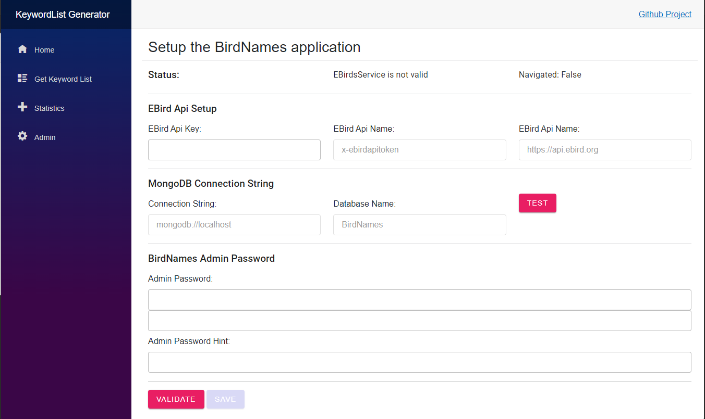
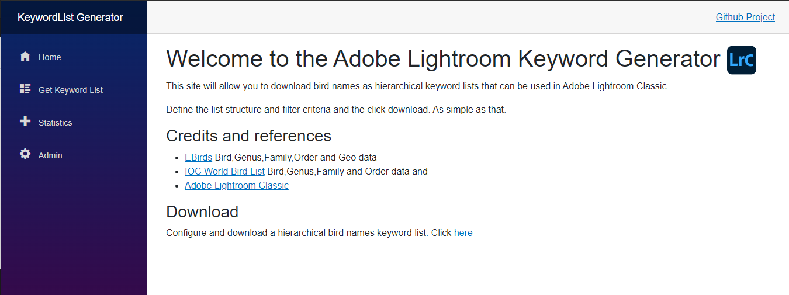
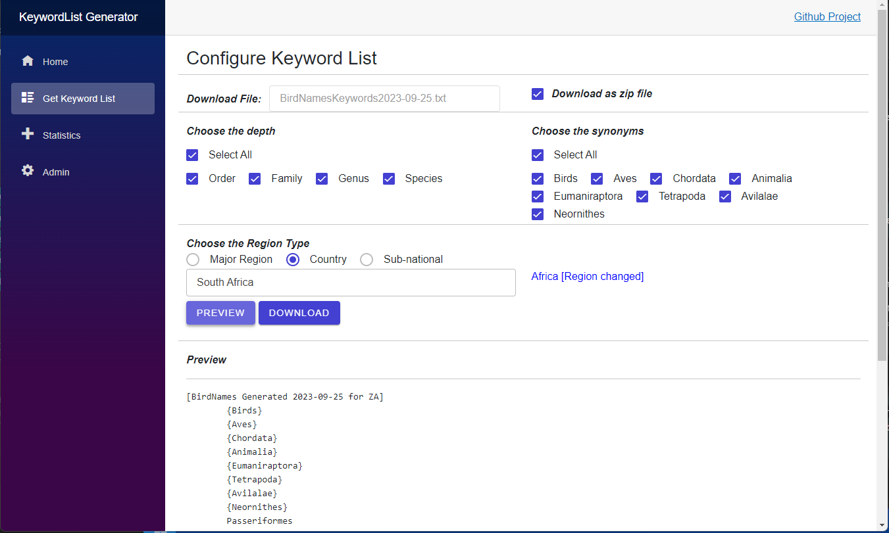
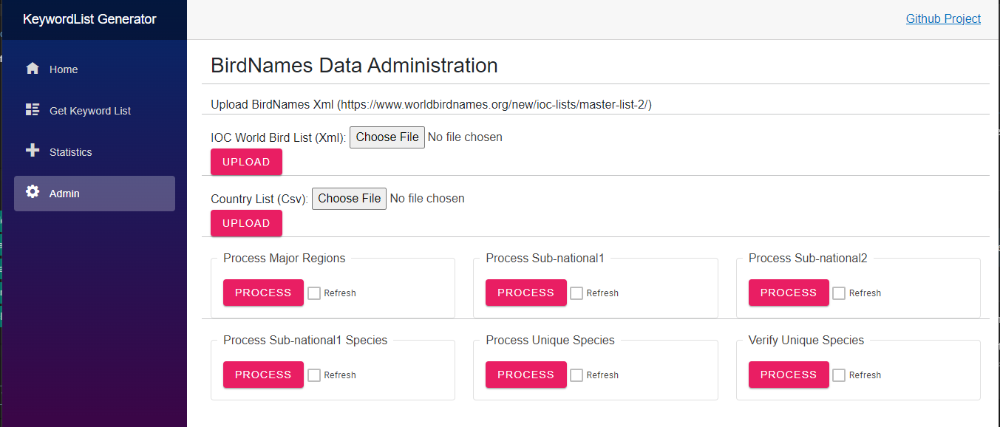
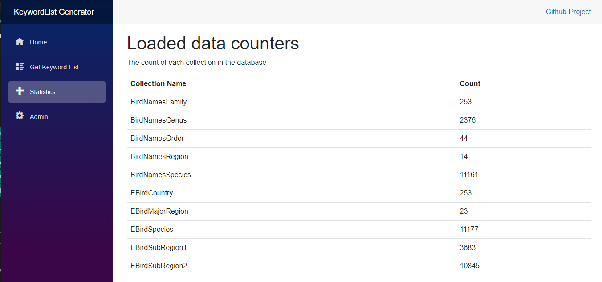

# BirdNames.Blazor 
The `BirdNames.Razor` project is developed with Microsoft Blazor technology and uses the Radzen Blazor components

## First Time Setup
This page will only show the first time that the project is loaded or if the setup has not been completed.  See screen below
### Enter EBird Api Key
Enter the API Key obtained from (https://ebird.org).  This API key is required to load the necessary data from the [EBird Api](https://documenter.getpostman.com/view/664302/S1ENwy59).  See documentation.  https://documenter.getpostman.com/view/664302/S1ENwy59.

### Test MongoDB Connection
The application expects MongoDB to be installed locally and be accessible on the default `port:27017`.  The defaults can be overridden in the `appsettings.json` file.  

### Admin Password
Enter and confirm an **Admin Password** for the web application.  This will be encrypted and stored in the settings file.  This password will unlock the admin functionality explained lower down.

### Validate and Save
Use the validate button to confirm all settings.  If validation passes, then the `Save` button will become available.  Save the settings before closing the application or navigating to another page.



## Home
The landing page has a link to the download page as well as a brief summary of the project.



## Download KeywordList
The download page allow users to download hierarchical keyword lists that can be imported into Adobe Lightroom Classic Catalogs.  

### Download as zip file:  
Allow users to minimize the download size by compressing the file into a zip.  The file need to be decompressed (un-zipped) before importing it into Adobe Lightroom Classic.

### Choose the depth: 
This option allow users to configure the depth of the hierarchy.  The default (all levels) are:
```
* Order
  * Family
    * Genus
      * Species
```

### Choose the synonyms:
Default is all synonyms.  These words will be added to the header of the keyword list file.

### Choose the Region Type:
The region type can either be a `Major Region` which are contents and sub contents like North America or Southern Africa.  It can also be a `Country` like South Africa (ZA).  Lastly it can a `Sub-national` region like a state or province in a country.  The page will allow the user to select a region type and then type to search and select a region.

### Preview and Download
Before downloading the hierarchical keywordlist file, the user must first preview and confirm the content.  If happy, click download to get the file in zip or text format.



## Admin
The `Admin` page can only accessed if an admin password is entered correctly.

### IOC Bird List (Xml) [OPTIONAL]
The user can optionally upload and process the latest world bird names xml master list.  It can be [downloaded]() from https://www.worldbirdnames.org/new/ioc-lists/master-list-2/ or the latest from the repo in the files directory

### Country List (CSV)
This file can be found in the files directory.  It is a list of countries with their codes and contents that are supported by the EBird API.

### Process EBird API data
Use the process button in order from left to right.  These button will in turn execute a download and after that the processing of data exposed by the EBird API.  The `Refresh` option will force a delete and reload if selected.  This should not be necessary, by not selecting to refresh, only new items will be processed and persisted to the database.



## Statistics
This page will display the number of documents (Region, Species etc) persisted to the database and available for selection when downloading the KeywordList files.




